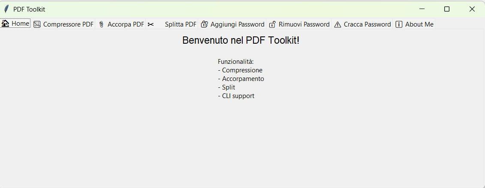
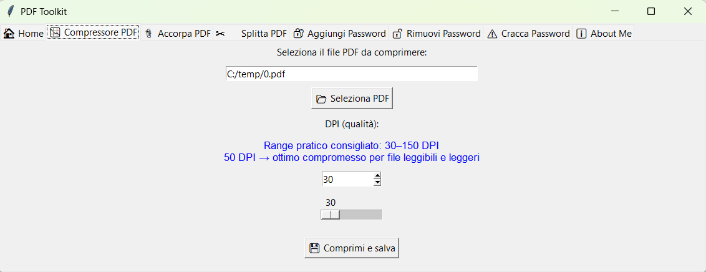
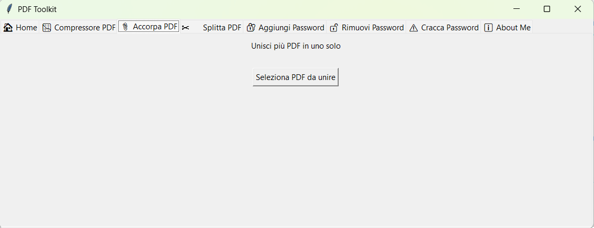
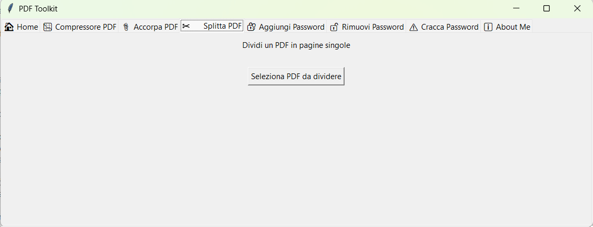
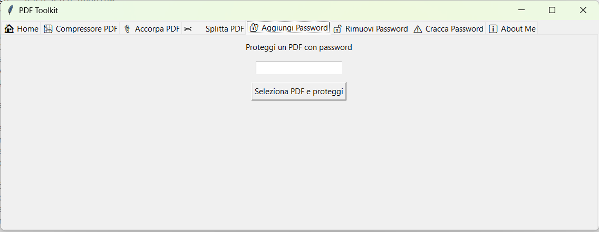
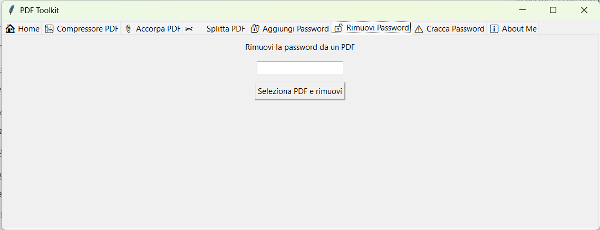
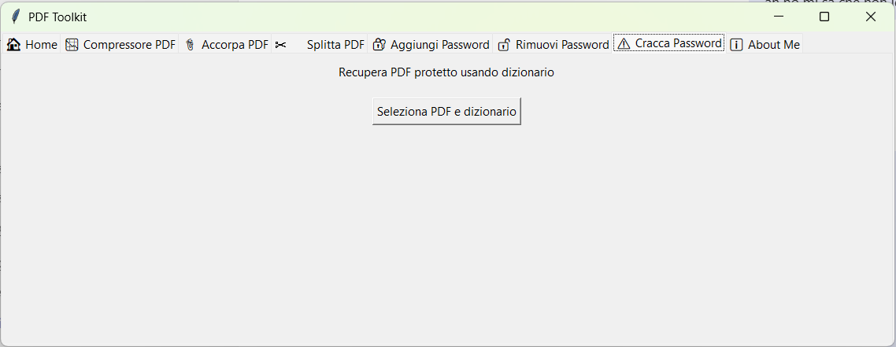
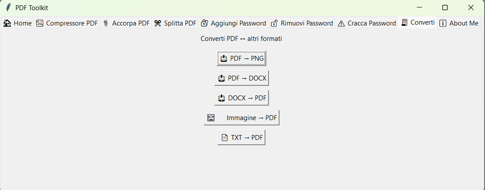

# PDF-Toolkit
PDF Toolkit :: il coltellino svizzero gratuito e open source per gestire i PDF

# 📚 PDF Toolkit – GUI + CLI per comprimere, unire, dividere e proteggere PDF

PDF Toolkit è un'applicazione Python multipiattaforma che ti permette di **comprimere**, **accorpare**, **splittare**, **proteggere** e **sbloccare** file PDF. Può essere utilizzata sia con una **interfaccia grafica (GUI)** intuitiva che da **riga di comando (CLI)** per automazioni e script.
Il programma può funzionare OFFLINE, non ha bisogno di connessione internet, i tuoi PDF sono al sicuro, non verranno inviati fuori dalla tua rete.

> ✅ Compatibile con **Windows** e **Linux**  
> ✅ Basato su **PyMuPDF**, **PyPDF2** e **Tkinter**  
> ✅ Nessuna dipendenza esterna pesante

---
# Installazione
## Windows
Si necessita di avere python installato.

1. Clona il repository
```bash
git clone https://github.com/AccaEmme/PDF-Toolkit.git
cd pdf-toolkit
```
2. Installa le dipendenze in modo globale
```bash
pip install openpyxl python-pptx pdf2docx pillow reportlab PyMuPDF PyPDF2 docx2pdf reportlab
```

2. Oppure installa le dipendenze in un ambiente virtuale (per non "sporcare" l'installazione globale)
```bash
python3 -m venv venv
$ source venv/bin/activate
$ pip install -r requirements.txt
```

## Linux
Si necessita di avere python installato e le dipendenze per manipolare le conversioni pdf
1. Clona il repository
```bash
sudo apt install libreoffice ghostscript
git clone https://github.com/AccaEmme/PDF-Toolkit.git
cd pdf-toolkit
```
2. Installa le dipendenze in modo globale
```bash
pip install openpyxl python-pptx pdf2docx pillow reportlab PyMuPDF PyPDF2 docx2pdf reportlab
```

2. Oppure installa le dipendenze in un ambiente virtuale (per non "sporcare" l'installazione globale)
```bash
python3 -m venv venv
$ source venv/bin/activate
$ pip install -r requirements.txt
```

# Come eseguirlo
## Su Windows con GUI (interfaccia grafica)
```bash
python pdf_toolkit.py
```

## Su Linux con GUI (interfaccia grafica)
```bash
python3 pdf_toolkit.py
```

## Su Windows/Linux da CLI (CommandLine Interface)
```bash
python pdf_toolkit.py compress input.pdf output.pdf --dpi 50
```


## 🚀 Funzionalità

### GUI (interfaccia grafica)
- 📉 Compressore PDF (DPI personalizzabile)
- 📎 Accorpa PDF
- ✂️ Splitta PDF
- 🔐 Aggiungi password
- 🔓 Rimuovi password
- ⚠️ Cracca password (solo per file di cui sei proprietario)
- 🔄 Conversioni supportate: Puoi convertire file PDF in altri formati e viceversa, sia da interfaccia grafica (GUI) che da riga di comando (CLI).
    * 📤 Da PDF verso:
        - pdf2png → Estrae ogni pagina del PDF come immagine PNG
        - pdf2docx → Converte PDF in documento Word modificabile
        - pdf2html → (non ancora implementato) Converti PDF in HTML
    * 📥 Verso PDF da:
        - docx2pdf → Converte file Word .docx in PDF
        - img2pdf → Converte immagini (.png, .jpg, .bmp) in PDF
        - txt2pdf → Converte file di testo .txt in PDF
- ℹ️ About Me

### >_⌨️ CLI (riga di comando)
Esegui le stesse operazioni direttamente da terminale:

```bash
# Comprimere un PDF
python pdf_toolkit.py compress input.pdf output.pdf --dpi 50

# Unire più PDF
python pdf_toolkit.py merge file1.pdf file2.pdf file3.pdf output.pdf

# Dividere un PDF in pagine singole
python pdf_toolkit.py split input.pdf

# Aggiungere una password
python pdf_toolkit.py addpw input.pdf output.pdf miaPassword123

# Rimuovere una password
python pdf_toolkit.py removepw protetto.pdf sbloccato.pdf miaPassword123

# Craccare una password (usando dizionario
python pdf_toolkit.py crackpw protetto.pdf sbloccato.pdf passwords.txt

# PDF → PNG
python pdf_toolkit.py pdf2png input.pdf output_folder/

# PDF → DOCX
python pdf_toolkit.py pdf2docx input.pdf output.docx

# DOCX → PDF
python pdf_toolkit.py docx2pdf input.docx output.pdf

# Immagine → PDF
python pdf_toolkit.py img2pdf immagine.jpg output.pdf

# TXT → PDF
python pdf_toolkit.py txt2pdf note.txt output.pdf
```

# Compressione: DPI e qualità
| DPI | Qualità | Note |
| --- | ------- | ---- |
| 30-50   | Alta compressione     | Testo leggibile forse sfocato, file molto leggero |
| 72 | 🖥️ standard per schermo | Buon compromesso: file leggibile | 
| 150 | 🖨️ Qualità da stampa leggera	| File più pesante |
| 300+ | Qualità elevata | File molto grande |

# 📄 Licenza
Questo progetto è distribuito sotto licenza MIT. Vedi il file LICENSE per i dettagli.
Contribuisci, segnala bug o proponi miglioramenti!


# Screenshots








